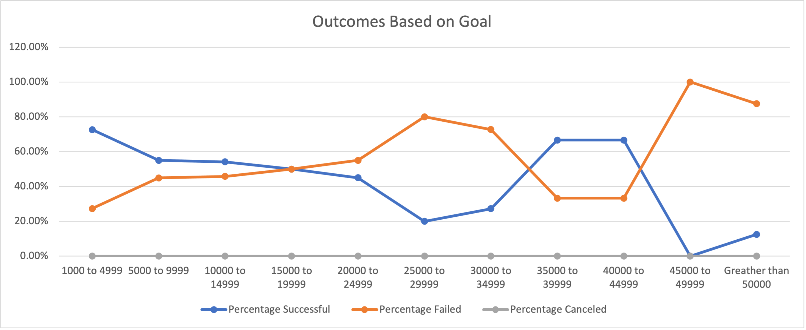

# Kickstarting with Excel
## Overview of Project
##### Purpose
        The purpose of this project was to provide up and coming playwright Louise with starting her crowdfunding campaign to pay for her first play, FEVER. Keeping in mind her budget of $10,000+ I assisted her in determining if there are specific factors or elements that make a campaign successful by organizing, sorting, and analyzing pre-existing crowdfunding data. These insights will allow Louise to understand her campaign from start to finish by mirroring other successful campaigns.In doing so, I personally got to develop and hone in my Excel skills through use of different functions, graphs, tables, etc. to perfect my analysis.
## Analysis and Challenges
##### Analysis of Findings
There are multiple factors to influence the success of crowdfunding campaigns but in this case, we will be looking specifically at theater outcomes based on launch date and outcomes based on goals for Louise. Through my analysis it was determined that there is a specific time of the year that yields the highest success rates of plays as well as a specific goal range where we also see the highest rate of success for plays. These findings are visually displayed in the attached images of the line graphs developed for each theory.

##### Challenges
Personal challenges I experienced during the analysis included comprehension issues of specific formulas such as “COUNTIFS”. I had two thirds of the necessary function completed but was struggling with how to articulate the “goals” part based on the provided parameters. This challenge was overcome by asking for assistance from classmates and utilizing their advice. One classmate took time to provide gentle guidance in how to complete my formula so that I could figure it out and make it work properly and I could complete the deliverable. Other issues experienced involve the Outcomes Based on Goals line graph displaying too much excess information from the entirety of the data field and not specifically just the percentages of successful, failed, and canceled plays. After playing around with Excel for a bit I eventually found out how to make the graph reflect the necessary information. I have noticed that figuring out how to edit graphs on a Mac differs a lot from on a PC, so there is a learning curve there when watching demonstrations in class versus doing it on my own.
## Results
##### Theater Outcomes by Launch Date
##### Outcomes Based on Goals
##### Summary
##### Limitations
##### Recommendations 
