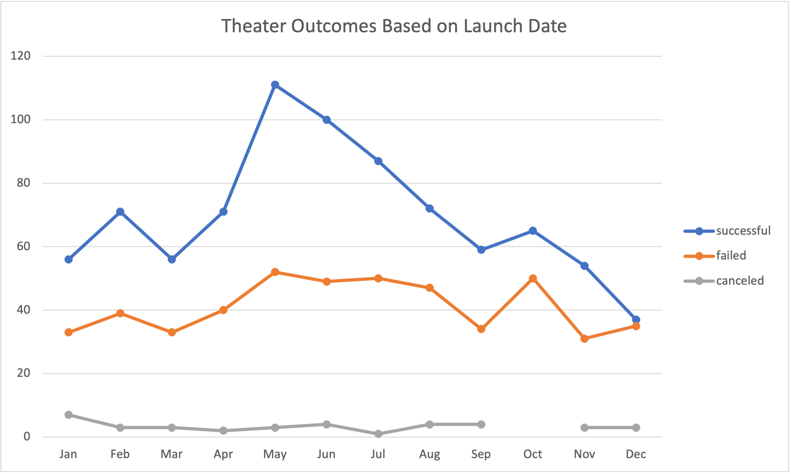

# Kickstarting with Excel
## Overview of Project
##### Purpose
        The purpose of this project was to provide up and coming playwright Louise with starting her crowdfunding campaign to pay for her first play, FEVER. Keeping in mind her budget of $10,000+ I assisted her in determining if there are specific factors or elements that make a campaign successful by organizing, sorting, and analyzing pre-existing crowdfunding data. These insights will allow Louise to understand her campaign from start to finish by mirroring other successful campaigns.
In doing so, I personally got to develop and hone in my Excel skills through use of different functions, graphs, tables, etc. to perfect my analysis.
## Analysis and Challenges
##### Analysis of Findings

##### Challenges

## Results
##### Theater Outcomes by Launch Date
##### Outcomes Based on Goals
##### Summary
##### Limitations
##### Recommendations 
